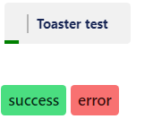
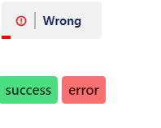

# React + Vite

This template provides a minimal setup to get React working in Vite with HMR and some ESLint rules.

Currently, two official plugins are available:

- [@vitejs/plugin-react](https://github.com/vitejs/vite-plugin-react/blob/main/packages/plugin-react/README.md) uses [Babel](https://babeljs.io/) for Fast Refresh
- [@vitejs/plugin-react-swc](https://github.com/vitejs/vite-plugin-react-swc) uses [SWC](https://swc.rs/) for Fast Refresh


before you should install the dependencies
```javascript
// step 1 : 
import Toaster from './components/Toaster'
// step 2 : 
create toasterRef = useRef(null)
// then assign it to Toaster component
<Toaster ref={toasterRef} />
// step 3: 
// With toasterRef.current we can access the toaster methods such as success and error 
toasterRef.current.success('This is a success message');
toasterRef.current.error('This is an error message');

## setp 4 : 
I'm a junior developer, so don't forget to leave a star ⭐ on the project if you find it useful!


